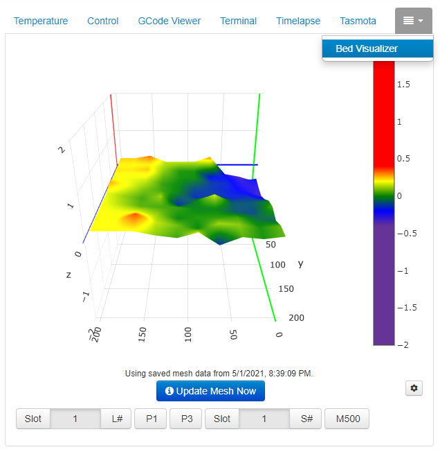
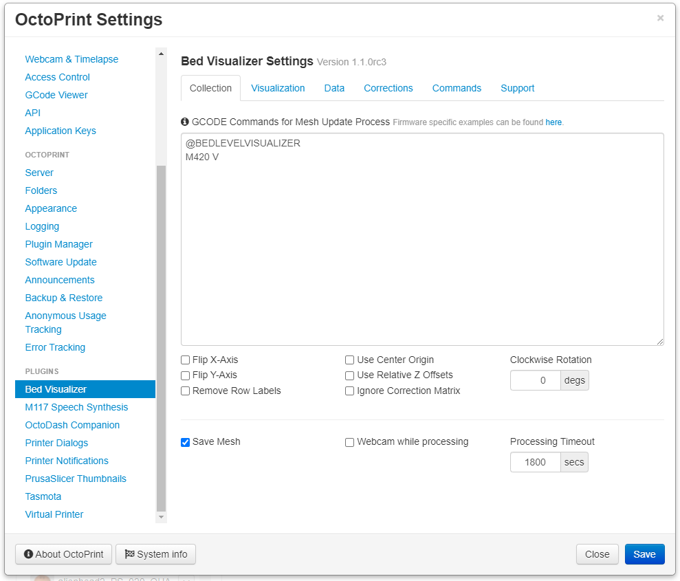
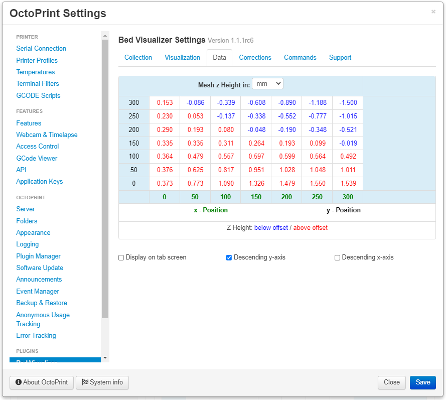
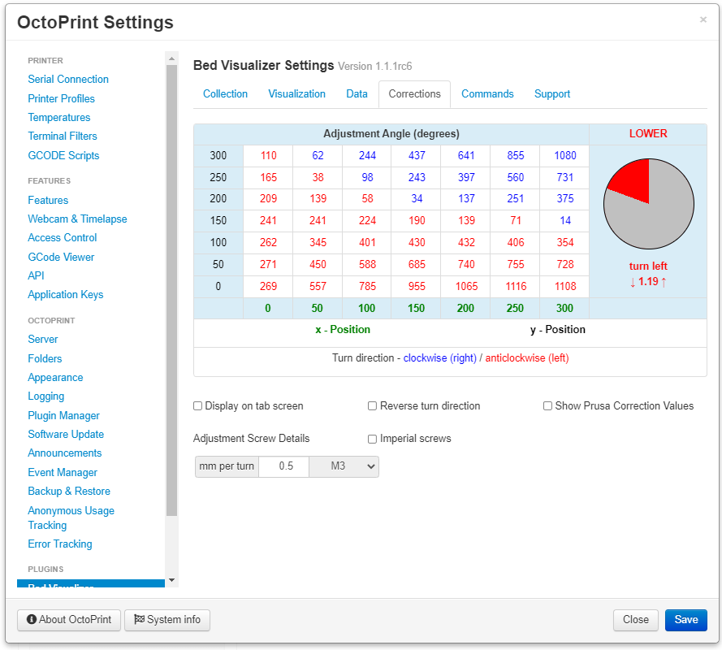
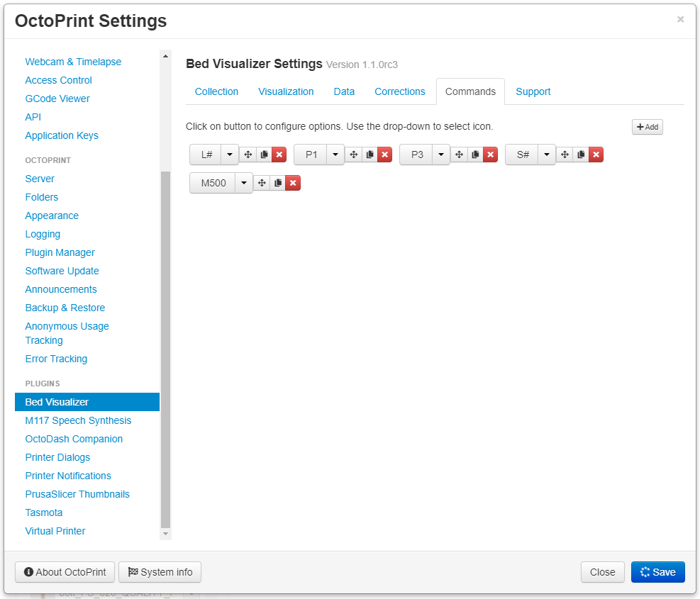
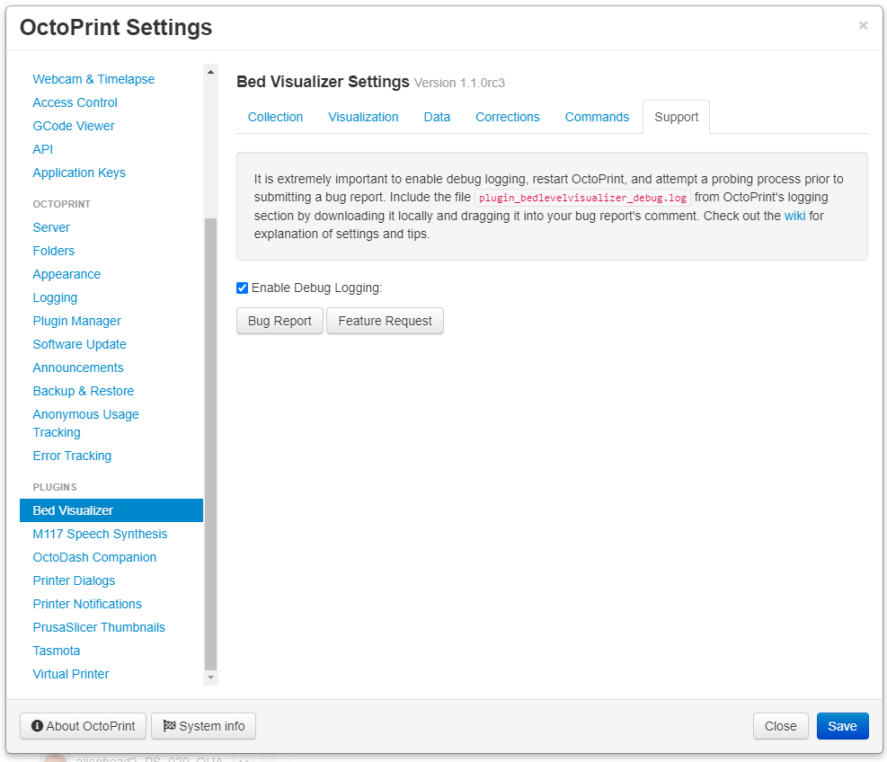

# Tab

---

Sometimes after installing depending on how many other plugin tabs you have, the Bed Visualizer tab may be hidden in the tab drop-down located in the upper-right of the tab navigation. This is where you will initiate the mesh [Collection](#Collection) process and have access to custom defined [Commands](#Commands).



* **Graph:** This is where you will find the rendered graph generated using mesh [Collection](#Collection) data and configured [Visualization](#Visualization) options. The graph will be replaced by the webcam during the mesh collection process if the show webcam option is enabled in settings.
* **Corrections:** (not enabled in screenshot above) This is where you will see the adjustment correction table as described in [Corrections](#Corrections).
* **Data:** (not enabled in screenshot above) This is where you will see reported z offsets reported by firmware as described in [Data](#Data).
* **Settings Button:** Click this button to go directly to the Bed Visualizer [Settings](#Settings).
* **Commands:** This is where custom defined [Commands](#Commands) will be displayed.

# Settings

---

## Collection
On this tab you will find all the settings related to collecting mesh data from your printer. Adjust these settings as necessary to get the correct orientation of your bed relative to the returned mesh data from your firmware.



* **GCODE Commands for Mesh Update Process:** For a collection of example GCODE commands see [here](gcode-examples.md). These examples are not exact requirements, but guidance on what are some of the more common commands based on firmware/leveling type combinations.
* **Save Mesh:** Enabling this option will cache the last collected mesh data in order to visualize without the need for probing. If you disable this option, the GCODE commands above will be run every time you switch to the Bed Visualizer tab. This can be convenient for firmware that allows for storing mesh data, ie UBL, and using the command `M420 V` for the GCODE commands. This option does not store your mesh data to EEPROM of your firmware, if you'd like to do that it's recommended to include `M500` in your collection command described above or as a custom [Command](#Commands).
* **Flip X-Axis:** If enabled the mesh data returned by your firmware will be reversed in the x direction (see Tips below).
* **Flip Y-Axis:** If enabled the mesh data returned by your firmware will be reversed in the y direction (see Tips below).

---

## Visualization
On this tab you will find all the settings related to the graphical aspects of the plotly graph. Use these settings to tweak the visual display.


* **Graph Z Limits:** Comma separated list of integers for controlling the z offset of the visualized graph in the format of <z-min>,<z-max>. For example the default value is -2,2. This also affects the color map.
* **Camera Positions:** For a couple of examples of different camera positions and how they look, please see [here](camera-positions.md)
* **Colorscale:** Array of percentage/color pairs, ie <code>[[0, "blue"],[1, "red"]]</code> will create a gradient between blue to red. Percentage values are in decimal format and colors can be HTML hex values or color names surrounded by double quotes. You can also use a named color scale from <a href="https://plotly.com/javascript/colorscales/">here</a>. Clear this setting to load the default option and click Save below.
* **Enable Local Snapshots of Rendered Graphs:** When enabled every time the graph is rendered a png snapshot will be downloaded by the browser.
* **Date Locale:** Enter the js locale string for date display format for last stored mesh message, if left blank this will default to your browser's date locale settings. See [here](https://www.w3schools.com/jsref/jsref_tolocalestring.asp) for additional information and possible values.

---

## Data
On this tab you will find a simple table display of the reported mesh data from the firmware. This is the source data of what is graphed in the tab.



* **Display on tab screen:** When enabled the z offset table shown above will be displayed below the rendered mesh graph on the Bed Visualizer tab.
* **Descending y-axis:** When enabled 0 will be on the bottom, and the highest y value will be at the top of the table.
* **Descending x-axis:** When enabled 0 will be on the far left, and the highest x value will be at the far right of the table.

---

## Corrections
On this tab you will find settings specific to screw adjustment corrections.

Hovering your mouse over cells will show direction and amount of turn needed on right side of table to achieve 0. Clicking on a cell will set that cell to 0 and all other numbers will be adjusted relative to that point in the table.



* **Display on tab screen:** When enabled the adjustment table shown above will be displayed below the rendered mesh graph on the Bed Visualizer tab.
* **Reverse turn direction:** When enabled the direction for turning the screw will be reversed.
* **Show Prusa Correction Values:** When enabled the graph will include back, front, left, right um values to enter into the printer's LCD, it's recommended to use relative Z offset in [Collection](#Collection) settings.
* **Imperial screws:** Enable this options to use Imperials screw definitions instead of metric.
* **Adjustment screw details:** This is the value equivalent to number of turns
---

## Commands
On this tab you can add custom commands that will render as buttons below the `Update Mesh Now` button. This is helpful if you want to manually control specific processes, ie sending UBL commands individually instead of as part of the overall Collection script.



* **Parameters:** For inserting a custom code parameter GCODE command, the plus button beside the parameter can be used, or the following syntax can be used:
```
%(parameter_name)s
```
#### Examples
Create a preheating command by adding a parameter called `bed_temp` with a default value of 60, the custom command including parameter would look like this:
```
M140 S%(bed_temp)s
```

Create a store mesh command by adding a parameter called `mesh_slot` with a default value of 1, the custom command including the parameter would look like this:
```
M420 S%(mesh_slot)s V
```

Create a load mesh command by adding a parameter called `mesh_slot` with a default value of 1, the custom command including the parameter would look like this:
```
M420 L%(mesh_slot)s V
```

---

## Support
On this tab you'll find information relevant to getting support.



* **Enable Debug Logging:** Enable this option to log additional information in OctoPrint's logging section to allow for additional troubleshooting when opening an issue.
* **Bug Report:** Use this button to initiate a bug report on GitHub repo.
* **Feature Request:** Use this button to initial a feature request on GitHub repo.

# Tips

---
  - If your leveling method requires homing first make sure to enter that as well in the GCODE Commands setting.
  - If you have Marlin's Auto Temperature Reporting feature enabled you will want to have M155 S30 and M155 S3 surrounding your reporting GCODE command, otherwise the collected data will be tainted with temperature information.
  - If you end up requiring multiple commands it is recommended to enter `@BEDLEVELVISUALIZER` just prior to the reporting command.
  - To figure out the correct Flip X/Y Axis options on the collections tab it's easiest to place something in a corner to trigger the probe earlier and run an update mesh process. Compare the graph to where you placed the object and adjust the flip options accordingly and run the update mesh process again.

# Theme Support

---
I've done my best in making the Bed Visualizer support themes. In some circumstances you may want to adjust the correction and data table colors for your specific theme for better readability. The following are the default classes used in the plugin for these tables.

```
.table thead tr.info > th, .table tbody tr td.info, .table tfoot tr.info > th {
    background-color: #d9edf7;
}

.table thead tr.info .raise, .table tbody tr .raise, .table tfoot tr.info .raise, .table tfoot tr td div span.raise {
    color: blue;
}

.table thead tr.info .lower, .table tbody tr .lower, .table tfoot tr.info .lower, .table tfoot tr td div span.lower {
    color: red;
}

div.raise > div.turn_circle {
    background-color: blue;
}

div.lower > div.turn_circle {
    background-color: red;
}

.table thead tr.info .x-axis-label, .table tbody tr .x-axis-label, .table tfoot tr.info .x-axis-label, .table tfoot tr .y-axis-label {
    color: black;
}

.table thead tr.info .y-axis-label, .table tbody tr .y-axis-label, .table tfoot tr.info .y-axis-label, .table tfoot tr .x-axis-label {
    color: green;
}
```

